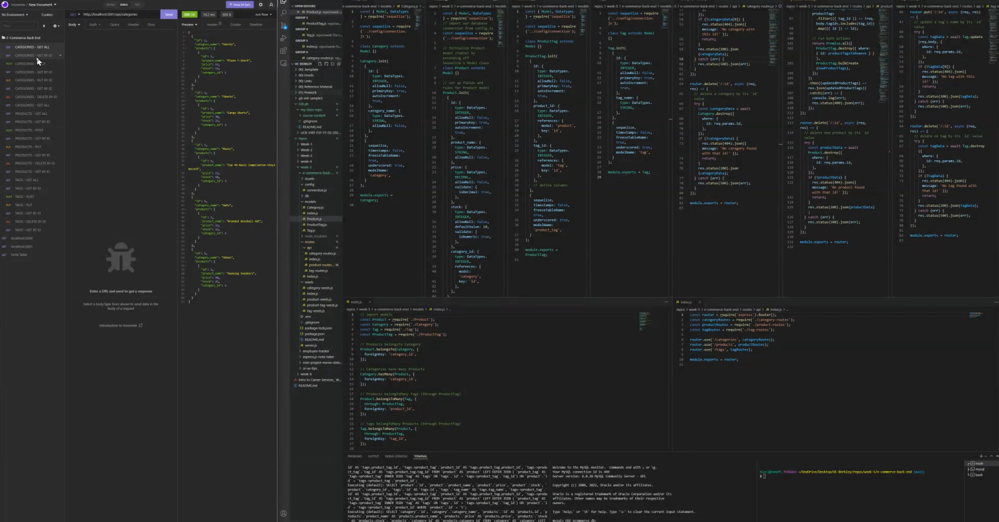

# E-Commerce Back End

Repository Name: e-commerce-back-end

## Table of Contents (Optional)

* [Description](#description)
* [Technologies](#technologies)
* [Installation](#installation)
* [Usage](#usage)
* [Final Product](#final-product)
* [Video](#video)
* [License](#license)
* [Acknowledgements](#acknowledgements)

## Description 

This is a console app that allows the user to edit department, role and employee information inside of a sql server database.

* Route Index.js - defining relationships between models.
```md
const Product = require('./Product');
const Category = require('./Category');
const Tag = require('./Tag');
const ProductTag = require('./ProductTag');

// Products belongsTo Category
Product.belongsTo(Category, {
  foreignKey: 'category_id',
});

// Categories have many Products
Category.hasMany(Product, {
  foreignKey: 'category_id',
});

// Products belongToMany Tags (through ProductTag)
Product.belongsToMany(Tag, {
  through: ProductTag,
  foreignKey: 'product_id',
});

// Tags belongToMany Products (through ProductTag)
Tag.belongsToMany(Product, {
  through: ProductTag,
  foreignKey: 'tag_id',
});
```

## Technologies

Technologies used on this project include:
* Backend Javascript to manage server
* Node.JS
* Express
* Sequelize
* NPM
* MySQL Server

## Installation

* NPM install (package.json already provided)
* Insomnia

## Usage 

To begin using this site after install requirements:

1. Simply run node start
2. Test routes using Insomnia

## Final Product




Github Repository
https://github.com/e-commerce-back-end


## Video

[](https://1drv.ms/v/s!AsbwJ61aj9fCjpEMpelKJ-s61POlvg?e=KYdyrG "Video")

https://1drv.ms/v/s!AsbwJ61aj9fCjpEMpelKJ-s61POlvg?e=KYdyrG

## License

MIT License

Copyright (c) 2022 Brennan LeClair

Permission is hereby granted, free of charge, to any person obtaining a copy
of this software and associated documentation files (the "Software"), to deal
in the Software without restriction, including without limitation the rights
to use, copy, modify, merge, publish, distribute, sublicense, and/or sell
copies of the Software, and to permit persons to whom the Software is
furnished to do so, subject to the following conditions:

The above copyright notice and this permission notice shall be included in all
copies or substantial portions of the Software.

THE SOFTWARE IS PROVIDED "AS IS", WITHOUT WARRANTY OF ANY KIND, EXPRESS OR
IMPLIED, INCLUDING BUT NOT LIMITED TO THE WARRANTIES OF MERCHANTABILITY,
FITNESS FOR A PARTICULAR PURPOSE AND NONINFRINGEMENT. IN NO EVENT SHALL THE
AUTHORS OR COPYRIGHT HOLDERS BE LIABLE FOR ANY CLAIM, DAMAGES OR OTHER
LIABILITY, WHETHER IN AN ACTION OF CONTRACT, TORT OR OTHERWISE, ARISING FROM,
OUT OF OR IN CONNECTION WITH THE SOFTWARE OR THE USE OR OTHER DEALINGS IN THE
SOFTWARE.


### Acknowledgements

©Brennan LeClair
